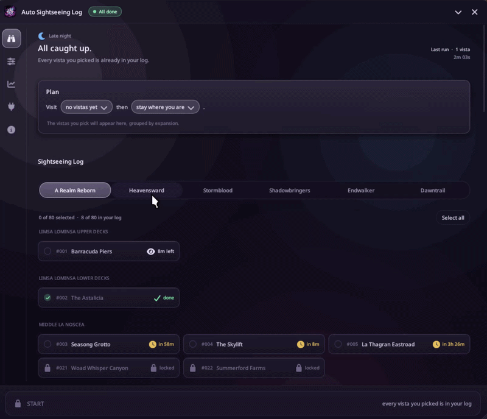

<p align="center">
  
</p>

<h1 align="center">Auto Sightseeing Log</h1>

<p align="center">
  <a href="https://discord.gg/hppkAvdBEE"></a>
  <a href="https://github.com/XeldarAlz/FFXIV-AutoSightseeingLog/releases/latest"></a>
  <a href="https://github.com/XeldarAlz/FFXIV-AutoSightseeingLog/releases"></a>
  <a href="https://github.com/XeldarAlz/FFXIV-AutoSightseeingLog/actions/workflows/release.yml"></a>
  <a href="LICENSE.md"></a>
</p>

<p align="center">
  <em>Sightseeing vistas, logged for you. Built on Dalamud.</em>
</p>

---

<p align="center">
  
</p>

## What it does

Lists every Sightseeing Log vista from A Realm Reborn through Dawntrail in one window, grouped by expansion and zone. Tick the vistas you want and press **Start**: the plugin teleports and flies to each one, waits for its hour and weather when it has them, performs the emote the log asks for, and moves on until every vista you picked is in your log.

## Features

- **The whole log**: all 340 vistas from A Realm Reborn through Dawntrail, grouped by zone, with the ones you haven't unlocked yet locked and what opens them one hover away.
- **Fresh characters**: if your Sightseeing Log itself is still locked, the run has Questionable complete “A Sight to Behold” for you first, then carries on to the vistas.
- **Live log progress**: reads which vistas you have logged straight from the game, so the window always matches your Sightseeing Log.
- **Time and weather windows**: works out when each A Realm Reborn vista's Eorzean hour and weather line up, and counts down to when it opens or closes.
- **Smart ordering**: visits open vistas before they close and lines up the rest for when their window opens.
- **Travel**: teleports to the nearest aetheryte and flies or walks to the spot, including the vistas whose marker sits where you can't stand.
- **Jump puzzles**: climbs the city jump puzzles it has a route for (Bokairo Inn and Shiokaze Hostelry in Kugane, Ruveydah Fibers Rooftop Garden in Radz-at-Han, Hunu'iliy in Tuliyollal), picks the climb back up after a missed jump, and leaves the puzzles it has no route for to you.
- **The right emote**: performs /lookout, /pray, /comfort or whichever emote each vista asks for, and checks that the log recorded it.
- **Hard spots**: when a vista sits on something the plugin cannot get onto by itself, it marks the spot in the world, points an arrow at it from above your character, flashes the game in your taskbar if you are in another window, and waits up to a minute for you to stand inside before carrying on. Turn it off in Settings for unattended runs. Settings also has when the box and the arrow show (always, near the spot, only when it needs you, or never) and how large the arrow is.
- **Recovery**: re-paths, jumps, side-steps, or teleports out when it gets stuck on the way, and waits out a fight before it emotes.
- **After the run**: stay where you are, return to the inn, log out to title, or close the game once a run finishes by itself.
- **Pause & resume**: park a run without losing your progress, and auto-pause while you're in a duty.
- **History**: every run recorded with the vistas logged and the zones visited.

## Install

In-game: `/xlsettings` → **Experimental** → paste into **Custom Plugin Repositories**:

```
https://raw.githubusercontent.com/XeldarAlz/DalamudPlugins/main/repo.json
```

Tick **Enabled**, click **+**, then **Save and Close**. Open `/xlplugins` → **All Plugins**, search for **Auto Sightseeing Log**, and install.

The plugin needs a helper for movement to be installed and loaded. Open `/asl deps` after install to see it and install it in one click. The same page offers Questionable as an optional helper: with it installed, a run on a character that has not unlocked the Sightseeing Log yet completes “A Sight to Behold” by itself before the tour.

## Commands

| Command | Action |
|---|---|
| `/asl` | Toggle the main window |
| `/sightseeing` | Alias for `/asl` |
| `/asl config` | Open the Settings page |
| `/asl stats` | Open the History page |
| `/asl deps` | Open the Plugins page |
| `/asl about` | Open the About page |
| `/asl changelog` | Open the Changelog page |
| `/asl pause` | Pause or resume the current run |
| `/asl goto <number>` | Travel to a vista without logging it (debug helper); `/asl goto stop` cancels |
| `/asl logdump` | Write the Sightseeing Log state to the plugin log (debug helper) |

## Languages

The windows are available in English, Deutsch, Français, Español, Português (Brasil), Русский, Türkçe, 日本語, and 中文. The plugin picks a language from your Dalamud and game client settings on first launch; change it any time under Settings, General, Language. Game data such as zone, vista, emote, and weather names always follows the game client.

Spotted a wrong or awkward translation? Open a [translation issue](https://github.com/XeldarAlz/FFXIV-AutoSightseeingLog/issues/new?template=translation_report.yml) and tell me what it should say instead.

## Community

Questions, ideas, or just want to hang out with other players? Come say hi on Discord.

→ [Join our Discord](https://discord.gg/hppkAvdBEE)

## More from me

If you liked this plugin, take a look at my other Dalamud work. You might find something else there for you.

→ [XeldarAlz Dalamud Plugins](https://github.com/XeldarAlz/DalamudPlugins)

## License

AGPL-3.0-or-later. See [LICENSE.md](LICENSE.md). [NOTICE](NOTICE) adds the attribution terms the AGPL allows: a fork, or any project that reuses this code, must credit the original author and must not pass itself off as the original. The license covers the code, not the name or the icon: read the [trademark and naming policy](TRADEMARK.md) before you publish a fork.

Some vista facts the game data does not carry come from other projects; they are credited in [THIRD-PARTY-NOTICES.md](THIRD-PARTY-NOTICES.md).

How AI is used to build this plugin is written down in [AI usage](AI-USAGE.md).
